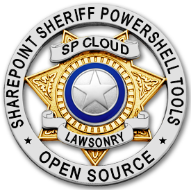

# Sharepoint Sheriff
A set of powershell tools to automate common and bulk tasks for those of us who have had Sharepoint Online administration dumped into our laps.

# Features

A set of cmdlets to be used in the Sharepoint Online Management Shell that will help you administer your institution's Sharepoint Online instance from the command line. These cmdlets have been designed with automation, efficiency, and hurry-up-and-go (HUG) administration in mind. 

# Installation 

## Prerequisites

Using Powershell to interface with Sharepoint Online requires you to have a copy of the [Sharepoint Online Management Shell][1] installed on your computer. 

## Downloading

Get yourself a copy of Sharepoint Sheriff by downloading the latest version. 

## Importing the cmdlets

As is normal in Powershell, you'll need to import the cmdlets into your script before you can use them. One easy way of doing this is to use the dot-source method. 

Simply add the `SPS-Suite.ps1` fullpath to the top of your script, like so:

```powershell
."C:\Users\Roosevelt\SPS-Suite.ps1"
write-host "I've included a Sharepoint Sheriff suite cmdlet!"

```

# Usage

## Create a new Subsite

```powershell
SPS-CreateSubsite -SiteUrl "https://yoursharepoint.sharepoint.com/aPrimarySite" -SubsiteUrl "MySubsite" -Title "My Special Subsite of aPrimarySite" 
```


[1]: https://www.microsoft.com/en-us/download/details.aspx?id=35588